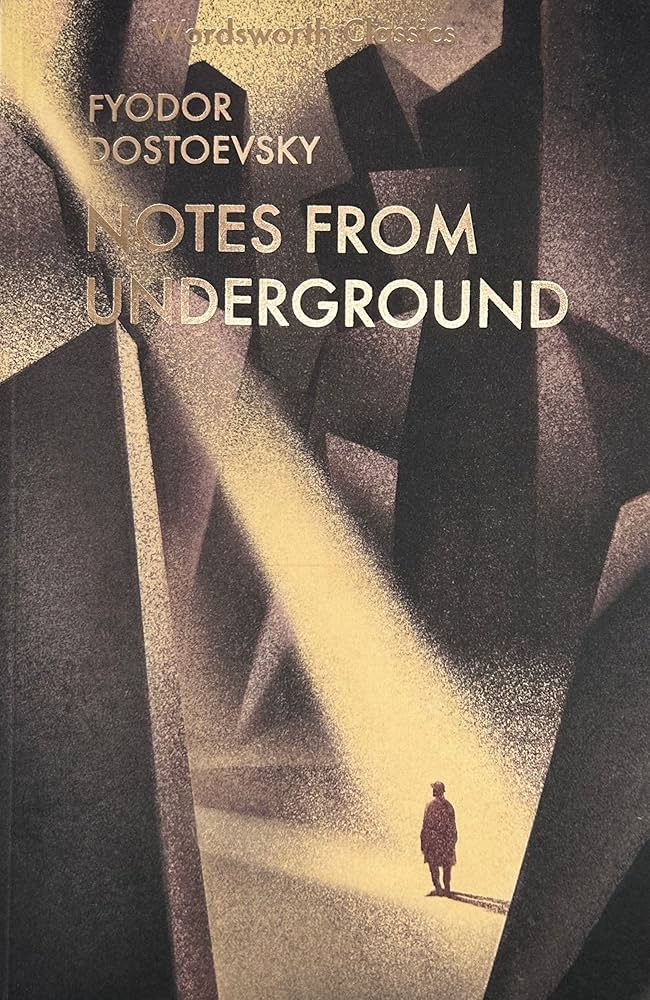
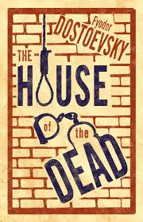

<link rel="stylesheet" type="text/css" href="styles.css">

 <!-- Include the shared navigation tabs -->

<body>
  <section class="default-text-format">
    <h2>Viktor E. Frankl's books:</h2>
    

      
      
      
    

  </section>

  <section class="default-text-format">
    <h2>Fyodor Dostoevsky's books:</h2>
    

      
      
      
      
      
      
    

  </section>
</body>
