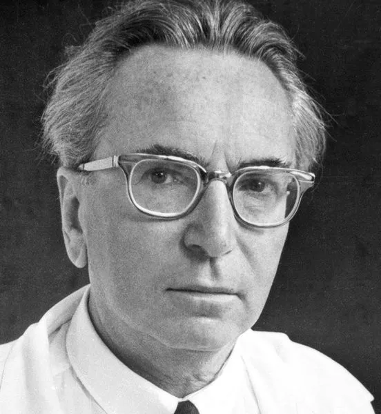

<link rel="stylesheet" type="text/css" href="styles.css">

 <!-- Include the shared navigation tabs -->

<body>
  <section class="default-text-format">
    <h2>Viktor Frankl</h2>
    
    

      Viktor Frankl was a prominent Austrian Psychiatrist of the 20th century who developed a new field of psychiatric practice he called logotherapy. The basic philosophical premise of logotherapy is that the fundamental drive in the human psyche is not the sex drive as Sigmund Freud believed, or a will to power as Alfred Adler believed, but what he called a “will to meaning,” that being a drive to find the basic purpose in one’s life.
    

    

      The Story of Viktor Frankl is especially inspiring because he was also a holocaust survivor. Because of his prestige, he had the opportunity to flee Austria during the development and expansion of Nazi power and control. But he knew that to do so would be to leave his parents to face the inevitable Nazi imprisonment alone. So, he decided to stay. Through tremendous courage and sacrifice, Dr. Frankl was willing to face the unspeakable turmoil he knew was coming. He spent the next three years of his life cycling through four concentration camps, including Auschwitz. Through this torturous experience, he found evidence for his logotherapeutic practice in noting that the people who were most likely to survive the camps were those who could find some sort of meaning or purpose in the midst of it.
    

    

      What follows is a handful of inspiring quotes from Viktor Frankl that help to illustrate his line of thinking and life’s work, in addition to his three major books and links for purchasing them.
    

    <blockquote>
      
That which is to give light must endure burning.

    </blockquote>
    <blockquote>
      
"In some ways, suffering ceases to be suffering at the moment it finds a meaning, such as the meaning of a sacrifice."

    </blockquote>
    <blockquote>
      
"Ultimately, man should not ask what the meaning of his life is, but rather must recognize that it is he who is being asked."

    </blockquote>
    <blockquote>
      
"Everything can be taken from a man but one thing: the last of the human freedoms - to choose one’s attitude in any given set of circumstances, to choose one’s own way."

    </blockquote>
    <blockquote>
      
"Even when it is not fully attained, we become better by striving for a higher goal."

    </blockquote>
  </section>

  <section class="default-text-format">
    <h2>Aleksandr Solzhenitsyn</h2>
    
    

      Aleksandr Solzhenitsyn was a member of the Russian aristocracy through the 20th century. Despite this, he lived a remarkably difficult life. Serving as a captain in the Red Army, he was forced to fight in some of the worst battles of World War 2 against the Nazis. After being declared treasonous for criticizing the way Stalin was handling the war, he was sent to the Gulags in Siberia. Solzhenitsyn spent the next eleven years of his life in these forced labor camps, where he eventually developed cancer. Nonetheless, he survived.
    

    

      After being released from the Gulag system, he wrote a memoir he called the Gulag Archipelago. His memoir, having sold millions of copies in multiple languages all over the world, served as one of the first pieces of irrefutable evidence portraying the depravity of the Soviet State and the Marxist Philosophy. This was effectively one of the final blows that brought down the Soviet Union and ended the Cold War.
    

    <blockquote>
      
“The line separating good and evil passes not through states, nor between classes, nor between political parties either -- but right through every human heart -- and through all human hearts. This line shifts. Inside us, it oscillates with the years. And even within hearts overwhelmed by evil, one small bridgehead of good is retained”

    </blockquote>
  </section>

  <section class="default-text-format">
    <h2>Fyodor Dostoevsky</h2>
    
    

    Fyodor Dostoevsky was an 1800s Russian novelist who is considered today to be one of the greatest writers in world history. He is known as one of the first existential philosophers, his incredible psychological insight, and for predicting the Russian revolution and its ensuing genocide over forty years before it took place. 
    

    

    Declared treasonous in 1850, he was sentenced to death by firing squad. While standing in front of the firing squad, there were finally orders received to send him to forced labor in Siberia for four years instead. This close encounter with death caused him to develop a rare form of epilepsy. After his four years of forced labor, he was forced to serve 8 years in the Russian army. Only after all of this pain and suffering did Dostoevsky write all of his greatest books he is most well known for today.
    

    <blockquote>
      
“Nothing in the world is harder than speaking the truth, nothing easier than flattery.”

    </blockquote>
    <blockquote>
      
“What is hell? I maintain that it is the suffering of being unable to love.”

    </blockquote>
    <blockquote>
      
“Love in action is a harsh and dreadful thing compared with love in dreams.”

    </blockquote>
    <blockquote>
      
“There is only one thing I dread: not being worthy of my sufferings.”

    </blockquote>
  </section>

</body>
